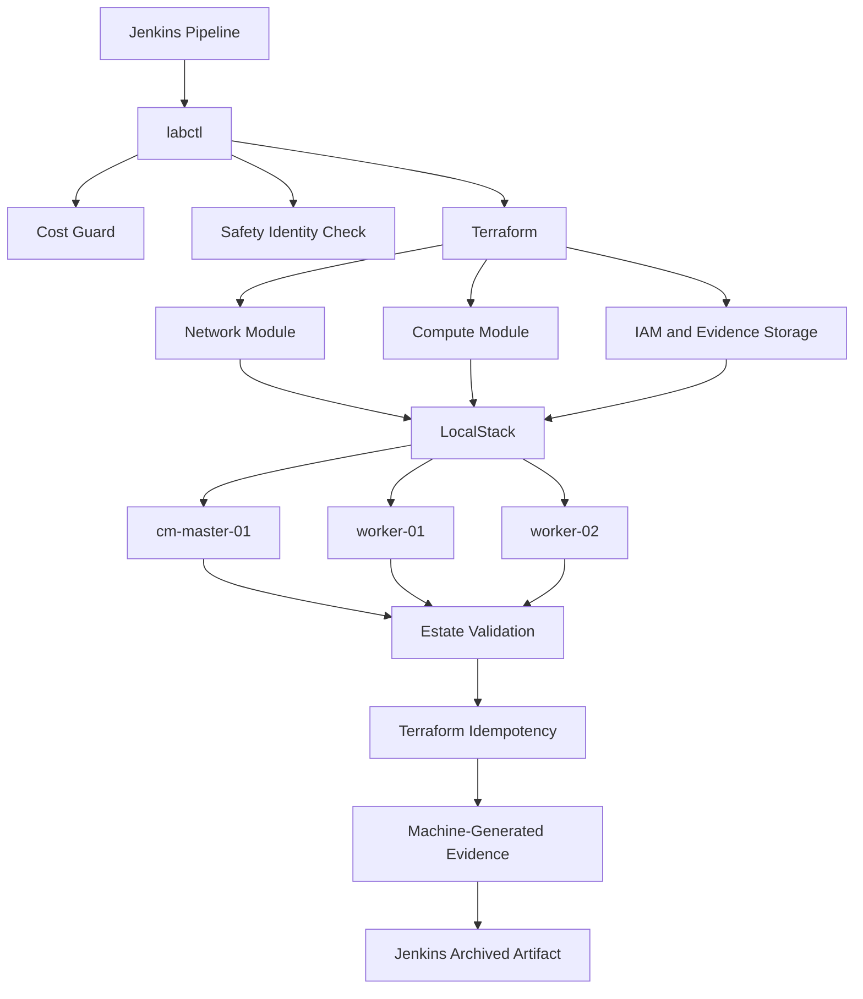

# Automated Distributed CDP Lab Provisioner

A Jenkins-driven infrastructure automation project for building reusable distributed data-platform labs using Terraform, Docker, Python, LocalStack, automated validation, safety controls, and machine-generated evidence.

The project is designed to demonstrate repeatable provisioning of short-lived Cloudera Data Platform (CDP) lab environments while keeping local development safe, reproducible, and inexpensive.

---

## Current Status

The current implementation provides a complete **LocalStack infrastructure-validation backend** driven by Jenkins.

Implemented capabilities include:

- Jenkins-driven provisioning workflow
- Containerized Jenkins controller
- Containerized provisioning toolchain
- Terraform infrastructure-as-code
- Reusable three-node topology
- Automated cost and safety guards
- LocalStack AWS-compatible infrastructure simulation
- Automated estate validation
- Terraform idempotency verification
- Machine-generated run evidence
- Jenkins artifact archival
- Zero real AWS resources during local development

The current simulated topology is:

| Node | Role | Target Size |
|---|---|---|
| `cm-master-01` | Management | `m6a.xlarge` / 4 vCPU / 16 GB |
| `worker-01` | Worker | `m6a.xlarge` / 4 vCPU / 16 GB |
| `worker-02` | Worker | `m6a.xlarge` / 4 vCPU / 16 GB |

---

## Architecture



---

## Automation Flow

The automated workflow follows this sequence:

```text
Jenkins
   |
   v
Preflight
   |
   v
Cost Guard
   |
   v
AWS / LocalStack Identity Validation
   |
   v
labctl
   |
   v
Terraform Init
   |
   v
Terraform Validate
   |
   v
Terraform Plan
   |
   v
Terraform Apply
   |
   v
3-Node Estate Validation
   |
   v
Second Terraform Plan
   |
   v
Idempotency Check
   |
   v
Evidence Generation
   |
   v
Jenkins Artifact Archive
```

---

## One-Command Workflow

Provision or reconcile the LocalStack environment:

```bash
.venv/bin/python labctl up \
  --backend localstack \
  --profile minimal \
  --security none
```

Validate the environment:

```bash
.venv/bin/python labctl validate \
  --backend localstack
```

Destroy the simulated estate:

```bash
.venv/bin/python labctl destroy \
  --backend localstack
```

The same `labctl` workflow is executed automatically from Jenkins.

---

## Jenkins Pipeline

The committed `Jenkinsfile` performs:

```text
Preflight
    ↓
Cost Guard
    ↓
LocalStack Identity Validation
    ↓
Provision Lab
    ↓
Terraform Validation
    ↓
Terraform Plan / Apply
    ↓
3-Node Estate Validation
    ↓
Terraform Second-Plan Check
    ↓
Evidence Generation
    ↓
Artifact Archival
```

The pipeline verifies that the LocalStack account is:

```text
000000000000
```

before infrastructure automation continues.

This prevents the LocalStack workflow from accidentally operating against a real AWS account.

---

## Measured LocalStack Evidence

The successful Jenkins-driven LocalStack validation run recorded:

```text
Backend:                 LocalStack
Nodes:                   3
Nodes validated:         3/3
Terraform idempotency:   PASS
Real AWS resources:      NO
AWS cost:                $0
Workflow time:           25.369 seconds
Overall:                 PASS
```

Machine-generated evidence is stored in:

```text
results/localstack_lab_run.json
```

Jenkins also archives this evidence as a build artifact.

### Important Benchmark Distinction

The `25.369 second` measurement represents only:

**LocalStack infrastructure/API provisioning and validation.**

It is **not** a real CDP Runtime deployment benchmark.

A real provisioning benchmark will only be recorded after the automation performs:

```text
Linux infrastructure
    ↓
Host bootstrap
    ↓
Cloudera Manager installation
    ↓
CDP Runtime deployment
    ↓
ZooKeeper
    ↓
HDFS
    ↓
YARN
    ↓
Hive
    ↓
Spark
    ↓
Functional workload validation
```

Real CDP timing will be stored separately, for example:

```text
results/cdp_provisioning_run.json
```

Only measured results from actual Linux hosts and functional CDP validation will be used for real provisioning-time claims.

---

## Terraform Infrastructure

The LocalStack backend currently provisions logical representations of:

- VPC
- Public subnet
- Internet gateway
- Route table
- Security group
- IAM role
- IAM instance profile
- Evidence S3 bucket
- Three EC2 node definitions

The compute topology consists of:

```text
cm-master-01
worker-01
worker-02
```

LocalStack uses mock EC2 management for infrastructure/API validation.

It does **not** run three full 16 GB virtual machines on the local workstation.

---

## Idempotency

Terraform idempotency is verified automatically.

After provisioning, the workflow executes a second Terraform plan using:

```text
-detailed-exitcode
```

A successful result requires:

```text
Terraform second-plan exit code: 0
Terraform infrastructure idempotency: PASS
```

Any unexpected infrastructure change causes validation to fail.

---

## Cost and Safety Controls

Real AWS provisioning is intentionally gated.

Current safety policy includes:

| Control | Limit |
|---|---|
| Maximum instances | 3 |
| Approved instance types | `m6a.xlarge`, `m6i.xlarge` |
| Maximum root volume | 60 GB per node |
| Maximum runtime | 60 minutes |
| Auto destroy | Required |
| Explicit AWS confirmation | Required |
| NAT Gateway | Disallowed |
| RDS | Disallowed |
| EKS | Disallowed |
| Load Balancer | Disallowed |
| GPU instances | Disallowed |

The LocalStack backend uses AWS-compatible dummy credentials and creates no real AWS resources.

Real AWS execution will additionally require explicit confirmation before any billable infrastructure can be created.

---

## Security Profiles

The configuration model includes the following security profiles:

```text
none
tls
kerberos
ldap
full
```

The current LocalStack workflow uses:

```text
--security none
```

Future real-host stages will add automated:

- TLS
- Kerberos
- LDAP / LDAPS
- combined secure-cluster configuration

---

## Repository Structure

```text
.
├── Jenkinsfile
├── README.md
├── labctl
├── docker-compose.local.yml
│
├── automation/
│   ├── localstack_backend.py
│   └── validate_cost_guard.py
│
├── config/
│   ├── cost-guard.yaml
│   ├── topology.yaml
│   ├── profiles/
│   └── security/
│
├── images/
│   ├── jenkins-controller/
│   └── lab-runner/
│
├── scripts/
│   └── terraform-local.sh
│
├── terraform/
│   ├── environments/
│   │   └── localstack/
│   └── modules/
│       ├── compute/
│       └── network/
│
└── results/
    └── localstack_lab_run.json
```

---

## Toolchain

Current development and automation stack:

```text
Jenkins
Terraform
Docker
Docker Compose
Python
LocalStack
AWS-compatible APIs
Git
GitHub
Linux
```

Target CDP automation stack:

```text
Cloudera Manager
CDP Runtime
ZooKeeper
HDFS
YARN
Hive
Spark
```

---

## Development Model

The project separates infrastructure development from expensive runtime validation.

### LocalStack Backend

Used for:

- Terraform development
- Jenkins workflow development
- infrastructure validation
- cost guard testing
- API behavior
- idempotency testing
- CI automation

Real AWS cost:

```text
$0
```

### Real Infrastructure Backend

Will be used only for final integration testing involving:

- actual x86_64 Linux hosts
- SSH connectivity
- host bootstrap
- Cloudera Manager
- CDP Runtime
- distributed service configuration
- functional workloads
- real provisioning benchmarks

---

## Planned Baseline CDP Services

The initial real Runtime profile will target:

```text
Cloudera Manager
ZooKeeper
HDFS
YARN
Hive
Spark
```

The objective is to create the smallest useful distributed CDP environment capable of executing real validation workloads.

---

## Planned Functional Validation

A real deployment will not be considered ready simply because services are running.

The automation will execute functional validation including:

```text
HDFS
  write
  read
  delete

YARN
  submit application
  verify completion

Hive
  create database/table
  insert/query data

Spark
  submit workload
  validate output

Cloudera Manager
  REST API health validation
```

Only after these checks pass will the environment be marked ready.

---

## Quick Start — Run in Your Own AWS Account

Project 11 provides two real-AWS workflows:

- `./run_nonsecure_cluster.sh` — builds and validates the base Hadoop/Hive/Spark environment.
- `./run_secure_cluster.sh` — builds the base environment and applies the full security stack.

### Prerequisites

Install:

- AWS CLI
- Terraform
- Python 3.11+
- OpenSSH
- Git

### 1. Configure AWS access

The tested configuration uses `us-east-1`.

```bash
export AWS_PROFILE=p11-lab
export AWS_REGION=us-east-1
export AWS_DEFAULT_REGION="$AWS_REGION"

aws sts get-caller-identity   --profile "$AWS_PROFILE"   --region "$AWS_REGION"
```

Use your own AWS CLI profile name if it is not `p11-lab`.

### 2. Create the EC2 SSH key

```bash
mkdir -p ~/.ssh

aws ec2 create-key-pair   --profile "$AWS_PROFILE"   --region "$AWS_REGION"   --key-name p11-cdp-lab   --query 'KeyMaterial'   --output text > ~/.ssh/p11-cdp-lab

chmod 600 ~/.ssh/p11-cdp-lab
```

If the AWS key pair already exists, use the matching private key instead of creating another key.

### 3. Create the Python environment

```bash
python3.11 -m venv .venv
./.venv/bin/python -m pip install --upgrade pip
./.venv/bin/pip install -r requirements-p11.txt
```

### 4. Authorize real AWS operations

```bash
export P11_ALLOW_AWS=YES
```

The infrastructure wrapper intentionally refuses billable or destructive AWS operations unless this variable is set.

### 5. Run the non-secure profile

```bash
./run_nonsecure_cluster.sh
```

This provisions AWS infrastructure, bootstraps the Linux hosts, installs Hadoop/Hive/Spark, configures the distributed services, runs functional workloads, validates Terraform idempotency, and writes evidence under:

```text
results/p11-live/nonsecure/
```

### 6. Run the secure profile

```bash
./run_secure_cluster.sh
```

The secure workflow applies:

```text
Base Hadoop / Hive / Spark
    ↓
Identity isolation
    ↓
LinuxContainerExecutor
    ↓
Kerberos
    ↓
TLS
    ↓
Secured HDFS / YARN
    ↓
LDAP / LDAPS
    ↓
Kerberos-secured Hive Metastore
    ↓
TLS + LDAP HiveServer2
    ↓
Secure MapReduce
    ↓
Secure Spark-on-YARN
    ↓
End-to-end acceptance validation
```

Secure evidence is written under:

```text
results/p11-live/secure/
```

A successful secure run ends with `overall: PASS`.

### 7. Destroy the AWS environment

When finished:

```bash
P11_ALLOW_AWS=YES scripts/p11_aws_infra.sh destroy
```

To automatically destroy the environment after a successful run:

```bash
P11_ALLOW_AWS=YES P11_AUTO_DESTROY=1 ./run_secure_cluster.sh
```

The same option can be used with `run_nonsecure_cluster.sh`.

### Using another AWS account or region

Set `AWS_PROFILE` to the profile for the target AWS account.

The tested configuration uses `us-east-1`. If you change regions, review the Terraform AMI configuration because AMI IDs are region-specific.

---

## Project Roadmap

### Completed

- Stage 1 — Local development foundation
- Stage 2 — Terraform-based AWS infrastructure
- Stage 3 — AWS safety controls and automatic instance shutdown
- Stage 4 — Reproducible non-secure distributed platform build
- Stage 5 — Linux host bootstrap and platform installation
- Stage 6 — Apache Hadoop 3.4.1 distributed HDFS and YARN deployment
- Stage 7 — Apache Hive 4.1.0 and Apache Spark 3.5.9 deployment
- Stage 8 — Non-secure functional validation
- Stage 9 — LinuxContainerExecutor and workload-user isolation
- Stage 10 — Kerberos authentication automation
- Stage 11 — TLS certificate and truststore automation
- Stage 12 — LDAP / LDAPS directory automation
- Stage 13 — Kerberos-secured HDFS and YARN
- Stage 14 — Kerberos-secured Hive Metastore
- Stage 15 — TLS + LDAP-authenticated HiveServer2
- Stage 16 — JCEKS-protected Hive LDAP bind credentials
- Stage 17 — Secure MapReduce validation as `p11admin`
- Stage 18 — Secure Spark-on-YARN validation as `p11admin`
- Stage 19 — End-to-end secure acceptance validation
- Stage 20 — Terraform idempotency validation
- Stage 21 — One-command non-secure and secure cluster runners

### Validated Profiles

The repository provides two executable real-AWS workflows:

- `run_nonsecure_cluster.sh` — provisions and validates the base distributed platform.
- `run_secure_cluster.sh` — provisions the base platform and then applies the full security stack in dependency order.

The secure profile validates:

- local workload identity separation,
- LinuxContainerExecutor,
- Kerberos authentication,
- TLS certificates and trust,
- secured HDFS,
- secured YARN,
- MapReduce as a non-service workload user,
- LDAP and LDAPS,
- Kerberos-protected Hive Metastore,
- TLS and LDAP-authenticated HiveServer2,
- credential-store protection for the Hive LDAP bind password,
- functional Hive SQL,
- and Spark-on-YARN as `p11admin`.

### Future Enhancements

- Clean-from-zero regression execution of the finalized secure runner
- CI execution and evidence archival for the real-AWS workflows
- Additional workload and failure-recovery scenarios
- Expanded benchmarking and provisioning-time measurements
## Project Goal

The goal is not simply to create infrastructure.

The project demonstrates a reusable engineering workflow that can:

1. provision a repeatable distributed environment on real AWS infrastructure,
2. enforce infrastructure and cost safeguards,
3. bootstrap Linux hosts,
4. install and configure distributed data-platform services,
5. establish both non-secure and secure operating profiles,
6. automate Kerberos, TLS, LDAP / LDAPS, and Linux workload isolation,
7. validate HDFS, YARN, MapReduce, Hive, and Spark with real workloads,
8. prove infrastructure idempotency,
9. generate machine-readable validation evidence,
10. and safely stop or tear down temporary infrastructure.

The secure workflow builds the base platform first and then applies security controls in dependency order:

`Identity → LinuxContainerExecutor → Kerberos → TLS → Hadoop security → LDAP/LDAPS → Hive security → final acceptance`

The implementation intentionally uses upstream Apache Hadoop, Apache Hive, Apache Spark, and 389 Directory Server so that the complete environment can be built and validated without proprietary platform dependencies.

> **Scope note:** This repository is a distributed data-platform automation and security lab. It does not install Cloudera Manager or proprietary Cloudera CDP Runtime components. The architecture and security mechanisms are designed to demonstrate engineering concepts directly relevant to enterprise Hadoop-based platforms without claiming to be a CDP deployment.