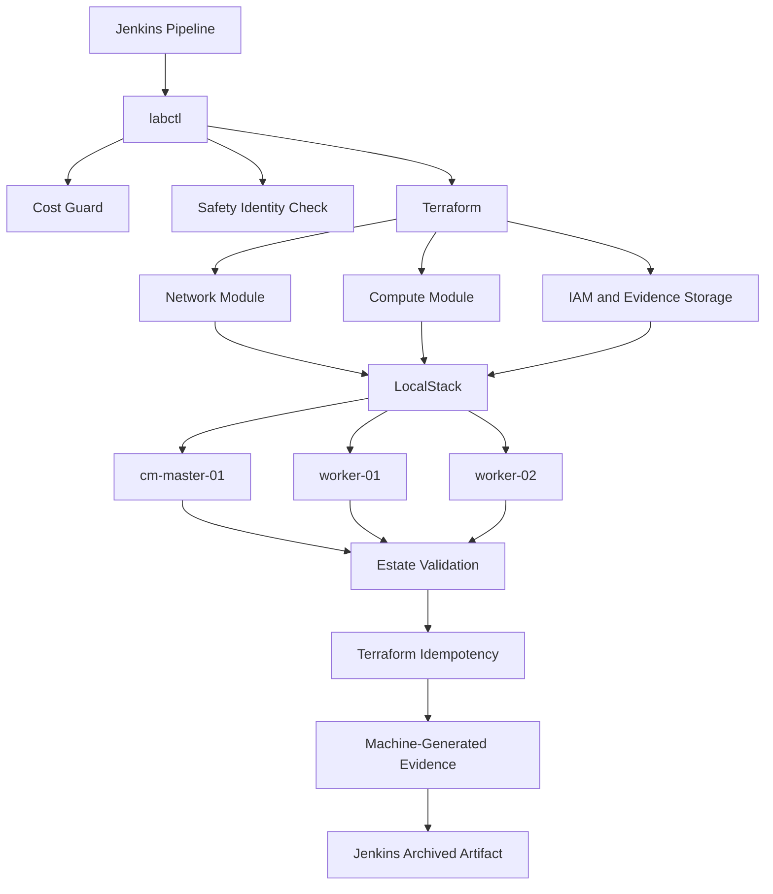

# Automated Distributed CDP Lab Provisioner

A Jenkins-driven infrastructure automation project for building reusable distributed data-platform labs using Terraform, Docker, Python, LocalStack, automated validation, safety controls, and machine-generated evidence.

The project is designed to demonstrate repeatable provisioning of short-lived Cloudera Data Platform (CDP) lab environments while keeping local development safe, reproducible, and inexpensive.

---

## Current Status

The current implementation provides a complete **LocalStack infrastructure-validation backend** driven by Jenkins.

Implemented capabilities include:

- Jenkins-driven provisioning workflow
- Containerized Jenkins controller
- Containerized provisioning toolchain
- Terraform infrastructure-as-code
- Reusable three-node topology
- Automated cost and safety guards
- LocalStack AWS-compatible infrastructure simulation
- Automated estate validation
- Terraform idempotency verification
- Machine-generated run evidence
- Jenkins artifact archival
- Zero real AWS resources during local development

The current simulated topology is:

| Node | Role | Target Size |
|---|---|---|
| `cm-master-01` | Management | `m6a.xlarge` / 4 vCPU / 16 GB |
| `worker-01` | Worker | `m6a.xlarge` / 4 vCPU / 16 GB |
| `worker-02` | Worker | `m6a.xlarge` / 4 vCPU / 16 GB |

---

## Architecture



---

## Automation Flow

The automated workflow follows this sequence:

```text
Jenkins
   |
   v
Preflight
   |
   v
Cost Guard
   |
   v
AWS / LocalStack Identity Validation
   |
   v
labctl
   |
   v
Terraform Init
   |
   v
Terraform Validate
   |
   v
Terraform Plan
   |
   v
Terraform Apply
   |
   v
3-Node Estate Validation
   |
   v
Second Terraform Plan
   |
   v
Idempotency Check
   |
   v
Evidence Generation
   |
   v
Jenkins Artifact Archive
```

---

## One-Command Workflow

Provision or reconcile the LocalStack environment:

```bash
.venv/bin/python labctl up \
  --backend localstack \
  --profile minimal \
  --security none
```

Validate the environment:

```bash
.venv/bin/python labctl validate \
  --backend localstack
```

Destroy the simulated estate:

```bash
.venv/bin/python labctl destroy \
  --backend localstack
```

The same `labctl` workflow is executed automatically from Jenkins.

---

## Jenkins Pipeline

The committed `Jenkinsfile` performs:

```text
Preflight
    ↓
Cost Guard
    ↓
LocalStack Identity Validation
    ↓
Provision Lab
    ↓
Terraform Validation
    ↓
Terraform Plan / Apply
    ↓
3-Node Estate Validation
    ↓
Terraform Second-Plan Check
    ↓
Evidence Generation
    ↓
Artifact Archival
```

The pipeline verifies that the LocalStack account is:

```text
000000000000
```

before infrastructure automation continues.

This prevents the LocalStack workflow from accidentally operating against a real AWS account.

---

## Measured LocalStack Evidence

The successful Jenkins-driven LocalStack validation run recorded:

```text
Backend:                 LocalStack
Nodes:                   3
Nodes validated:         3/3
Terraform idempotency:   PASS
Real AWS resources:      NO
AWS cost:                $0
Workflow time:           25.369 seconds
Overall:                 PASS
```

Machine-generated evidence is stored in:

```text
results/localstack_lab_run.json
```

Jenkins also archives this evidence as a build artifact.

### Important Benchmark Distinction

The `25.369 second` measurement represents only:

**LocalStack infrastructure/API provisioning and validation.**

It is **not** a real CDP Runtime deployment benchmark.

A real provisioning benchmark will only be recorded after the automation performs:

```text
Linux infrastructure
    ↓
Host bootstrap
    ↓
Cloudera Manager installation
    ↓
CDP Runtime deployment
    ↓
ZooKeeper
    ↓
HDFS
    ↓
YARN
    ↓
Hive
    ↓
Spark
    ↓
Functional workload validation
```

Real CDP timing will be stored separately, for example:

```text
results/cdp_provisioning_run.json
```

Only measured results from actual Linux hosts and functional CDP validation will be used for real provisioning-time claims.

---

## Terraform Infrastructure

The LocalStack backend currently provisions logical representations of:

- VPC
- Public subnet
- Internet gateway
- Route table
- Security group
- IAM role
- IAM instance profile
- Evidence S3 bucket
- Three EC2 node definitions

The compute topology consists of:

```text
cm-master-01
worker-01
worker-02
```

LocalStack uses mock EC2 management for infrastructure/API validation.

It does **not** run three full 16 GB virtual machines on the local workstation.

---

## Idempotency

Terraform idempotency is verified automatically.

After provisioning, the workflow executes a second Terraform plan using:

```text
-detailed-exitcode
```

A successful result requires:

```text
Terraform second-plan exit code: 0
Terraform infrastructure idempotency: PASS
```

Any unexpected infrastructure change causes validation to fail.

---

## Cost and Safety Controls

Real AWS provisioning is intentionally gated.

Current safety policy includes:

| Control | Limit |
|---|---|
| Maximum instances | 3 |
| Approved instance types | `m6a.xlarge`, `m6i.xlarge` |
| Maximum root volume | 60 GB per node |
| Maximum runtime | 60 minutes |
| Auto destroy | Required |
| Explicit AWS confirmation | Required |
| NAT Gateway | Disallowed |
| RDS | Disallowed |
| EKS | Disallowed |
| Load Balancer | Disallowed |
| GPU instances | Disallowed |

The LocalStack backend uses AWS-compatible dummy credentials and creates no real AWS resources.

Real AWS execution will additionally require explicit confirmation before any billable infrastructure can be created.

---

## Security Profiles

The configuration model includes the following security profiles:

```text
none
tls
kerberos
ldap
full
```

The current LocalStack workflow uses:

```text
--security none
```

Future real-host stages will add automated:

- TLS
- Kerberos
- LDAP / LDAPS
- combined secure-cluster configuration

---

## Repository Structure

```text
.
├── Jenkinsfile
├── README.md
├── labctl
├── docker-compose.local.yml
│
├── automation/
│   ├── localstack_backend.py
│   └── validate_cost_guard.py
│
├── config/
│   ├── cost-guard.yaml
│   ├── topology.yaml
│   ├── profiles/
│   └── security/
│
├── images/
│   ├── jenkins-controller/
│   └── lab-runner/
│
├── scripts/
│   └── terraform-local.sh
│
├── terraform/
│   ├── environments/
│   │   └── localstack/
│   └── modules/
│       ├── compute/
│       └── network/
│
└── results/
    └── localstack_lab_run.json
```

---

## Toolchain

Current development and automation stack:

```text
Jenkins
Terraform
Docker
Docker Compose
Python
LocalStack
AWS-compatible APIs
Git
GitHub
Linux
```

Target CDP automation stack:

```text
Cloudera Manager
CDP Runtime
ZooKeeper
HDFS
YARN
Hive
Spark
```

---

## Development Model

The project separates infrastructure development from expensive runtime validation.

### LocalStack Backend

Used for:

- Terraform development
- Jenkins workflow development
- infrastructure validation
- cost guard testing
- API behavior
- idempotency testing
- CI automation

Real AWS cost:

```text
$0
```

### Real Infrastructure Backend

Will be used only for final integration testing involving:

- actual x86_64 Linux hosts
- SSH connectivity
- host bootstrap
- Cloudera Manager
- CDP Runtime
- distributed service configuration
- functional workloads
- real provisioning benchmarks

---

## Planned Baseline CDP Services

The initial real Runtime profile will target:

```text
Cloudera Manager
ZooKeeper
HDFS
YARN
Hive
Spark
```

The objective is to create the smallest useful distributed CDP environment capable of executing real validation workloads.

---

## Planned Functional Validation

A real deployment will not be considered ready simply because services are running.

The automation will execute functional validation including:

```text
HDFS
  write
  read
  delete

YARN
  submit application
  verify completion

Hive
  create database/table
  insert/query data

Spark
  submit workload
  validate output

Cloudera Manager
  REST API health validation
```

Only after these checks pass will the environment be marked ready.

---

## Project Roadmap

### Completed

- Stage 1 — Local development foundation
- Stage 2 — Terraform infrastructure
- Stage 3 — One-command `labctl` automation
- Stage 4 — Jenkins-driven provisioning pipeline

### Planned

- Stage 5 — Real AWS safety backend
- Stage 6 — Linux host bootstrap
- Stage 7 — Cloudera Manager installation
- Stage 8 — CDP Runtime deployment
- Stage 9 — Functional workload validation
- Stage 10 — Real provisioning benchmark
- Stage 11 — TLS automation
- Stage 12 — Kerberos automation
- Stage 13 — LDAP / LDAPS automation

---

## Project Goal

The goal is not simply to create infrastructure.

The project is designed to demonstrate a reusable engineering workflow that can:

1. provision a repeatable distributed environment,
2. enforce infrastructure and cost safeguards,
3. configure platform prerequisites,
4. deploy distributed services,
5. validate actual functionality,
6. prove infrastructure idempotency,
7. generate measurable evidence,
8. archive results through Jenkins,
9. and automatically tear down temporary infrastructure.

The LocalStack implementation provides the safe development and CI foundation.

The final implementation will extend the same workflow to short-lived real Linux infrastructure and an actual distributed CDP Runtime environment.
